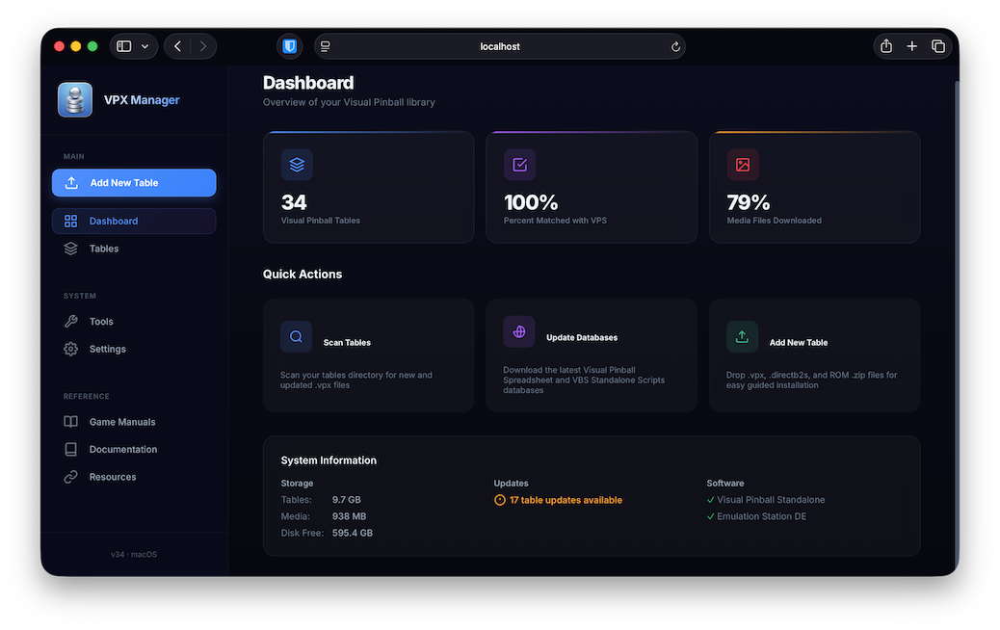
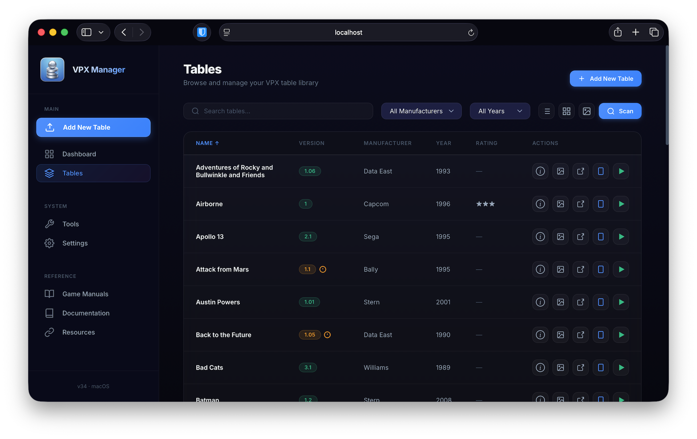
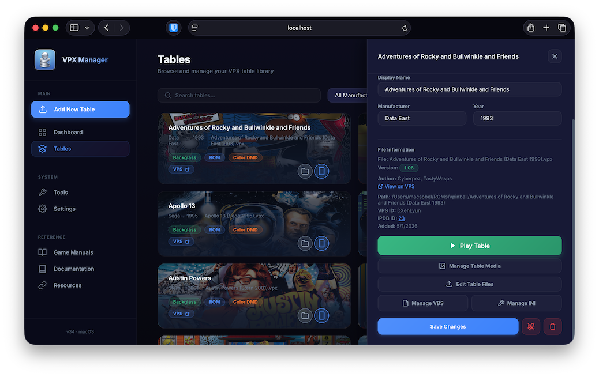
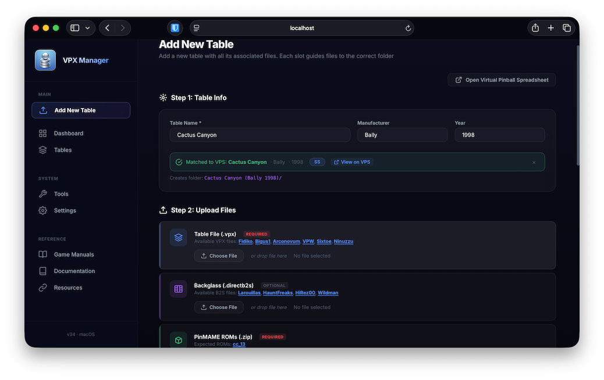
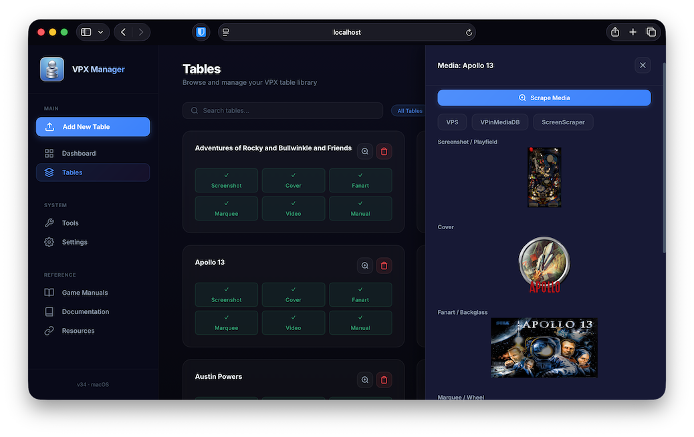
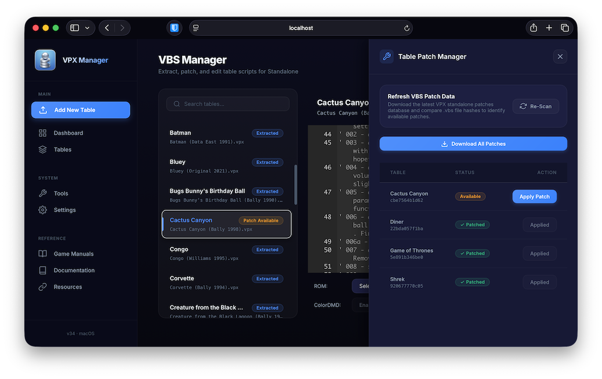
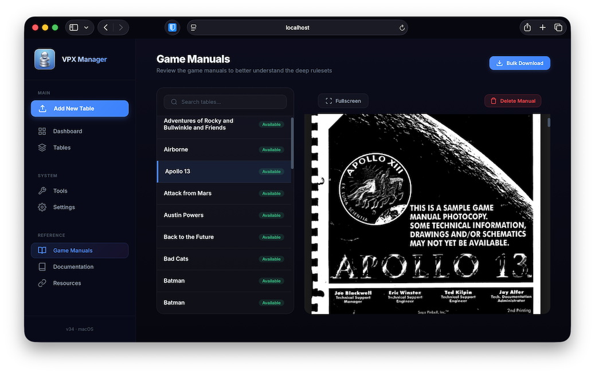

# VPX Manager for ES-DE

**VPX Manager for ES-DE** is a local web-based table and media management suite for [Visual Pinball Standalone](https://github.com/vpinball/vpinball) that handles table updates, media scraping, and support file management while integrating with [EmulationStation Desktop Edition](https://es-de.org/). The hobby has a steep learning curve, and VPX Manager tries to flatten it by walking you through each step of turning ES-DE into a polished virtual pinball frontend on macOS or Linux, whether on your desktop or powering a **virtual pinball cabinet**.

It automates scraping metadata and media from sources like [ScreenScraper](https://www.screenscraper.fr/) and [VPinMediaDB](https://github.com/superhac/vpinmediadb), installs the scripts needed to launch VPX tables, and adds second-screen backglass support that ES-DE doesn't offer natively.

<p align="center">
  
</p>

<p align="center">
  <a href="https://github.com/macsobel/VPX-Manager-for-ES-DE/releases">
    
  </a>
  <a href="https://github.com/macsobel/VPX-Manager-for-ES-DE/releases">
    
  </a>
  <a href="https://github.com/macsobel/VPX-Manager-for-ES-DE/releases">
    
  </a>
</p>

---

## Features

### Table & Media Management

- Checks your `.vpx` files against the [Visual Pinball Spreadsheet](https://virtualpinballspreadsheet.github.io/) to automatically match and rename your files for consistency.
- Monitors your table files for available updates.
- Guides you through importing and updating everything a table needs to run: ROMs, backglass files, PUPacks, AltColor, and AltSound.
- Downloads artwork for each table automatically (cabinet art, fanart, logos, and marquee images) and allows you to customize what media you want to use for each.
- Packages tables for Visual Pinball on [iOS](https://apps.apple.com/us/app/visual-pinball/id6547859926) and Android, including AirSync via Safari.
- Provides an integrated game manual reader for reading the rules and reference material for each table in your collection.

### Emulation Station DE Integration

- Automates the process of enabling Visual Pinball as a system in ES-DE and keeps your table list current.
- Provides a custom backglass art screen on a secondary monitor that syncs with whichever table you have selected in ES-DE.
- Scripts a seamless return to ES-DE as soon as you close a Visual Pinball table.

### Technical Features

- Patches table scripts automatically using jsm174's [standalone script repository](https://github.com/jsm174/vpx-standalone-scripts) so older tables work on macOS and Linux.
- Automatically installs NVRAM files for Bally MPU 6803 and Gottlieb System 3 tables so they boot correctly.
- Built-in settings editor for VPX config files (VBS, INI).
- Runs natively on macOS (available now) and Linux (coming soon).
- Interface optimized for desktop and mobile

---

## Screenshots

<p align="center">
  
  <br><em>Main dashboard overview showing library stats and available table updates.</em>
</p>

<p align="center">
  
  <br><em>Table list view showing details, allowing users to launch VPX, and package tables for mobile.</em>
</p>

<p align="center">
  
  <br><em>Table card view showing installed features (e.g., PUPacks, AltColor, and AltSound).</em>
</p>

<p align="center">
  
  <br><em>Guided new table installation page with links to VPS and automatic patching of VBS and NVRAM files.</em>
</p>

<p align="center">
  
  <br><em>Media file scraper for artwork from ScreenScraper and VPinMediaDB, with ability to rotate images and videos.</em>
</p>

<p align="center">
  
  <br><em>VBS manager for extracting and patching table scripts for standalone compatibility.</em>
</p>

<p align="center">
  
  <br><em>Integrated PDF viewer for reading game manuals and rule sheets.</em>
</p>

---
## Prerequisites
VPX Manager requires the following components have been installed and opened at least one time:
* **[Visual Pinball X \(Standalone\)](https://github.com/vpinball/vpinball)**: Necessary for table execution and VBS script handling.
* **[EmulationStation Desktop Edition \(ES-DE\)](https://es-de.org/)**: *Optional* but required for frontend integration and media synchronization on the desktop or as a virtual pinball cabinet.
## Installation

### 🍏 macOS

1. Download the macOS app from the [Releases](https://github.com/macsobel/VPX-Manager-for-ES-DE/releases) page and move it to your Applications folder.

2. Open **Terminal** and run the following command to clear the Gatekeeper quarantine flag:

   ```bash
   xattr -cr "/Applications/VPX Manager for ES-DE.app"
   ```

   > **Note:** macOS may block the app on first launch with a "damaged and can't be opened" warning. The command above resolves this.

3. Double-click **VPX Manager for ES-DE** to launch it.

---

### 🐧 Linux *(Beta Coming Soon)*

1. Download the Linux app from the [Releases](https://github.com/macsobel/VPX-Manager-for-ES-DE/releases) page and extract it.

2. Make the file executable:

   ```bash
   chmod +x VPX_Manager
   ```

3. Launch it by double-clicking the file, or run it from the terminal:

   ```bash
   ./VPX_Manager
   ```

---

## 🌐 Getting Started Accessing the Web UI
1. Launch **VPX Manager for ES-DE** from your Applications folder
2. Click the pinball icon in your menu bar (macOS) or taskbar (Linux) and choose **Open Web UI**. You can also open it directly in any browser at: `http://localhost:8746` 
   * Or use your machine's local hostname (e.g., `http://macmini.local:8746`).
3. Navigate to **Settings** and set the absolute paths for the VPX executable and ES-DE application, as well as enter your **ScreenScraper login** information to obtain more access to media files.
4. Perform an initial **VPS database update** and **scan your tables** in the **Dashboard** to index your `.vpx` collection.

On your initial visit, the **First Run Setup Guide** should walk you through each of the steps to get started. You can also visit the Documentation page at any time to revisit these steps.

---

### Configuration

The app stores its configuration and database here:

| Platform | Path |
|----------|------|
| macOS | `~/Library/Application Support/VPX Manager for ES-DE/` |
| Linux | `~/.config/VPX Manager for ES-DE/` |

---

## Acknowledgements

Thanks to the community members who make this hobby possible:

- **@jsm174** for leading the effort to bring [VPX to macOS and Linux](https://github.com/vpinball/vpinball), and for the [standalone table scripts](https://github.com/jsm174/vpx-standalone-scripts) that enable older tables.
- **The VPS Team** (@Dux, @Fraesh, @Studlygoorite) for the [Virtual Pinball Spreadsheet](https://virtualpinballspreadsheet.github.io/) and keeping it open for the community to build on.
- **The ScreenScraper Team** for their [emulation media database](https://www.screenscraper.fr/).
- **@superhac** for [VPinMediaDB](https://github.com/superhac/vpinmediadb), an open media library for virtual pinball frontends.
- **@dekay** for the [Unofficial VPinball Wiki](https://github.com/dekay/vpinball-wiki/wiki).
- **@MajorFrenchy** for his [virtual pinball tutorials and guides](https://www.majorfrenchy.com/).
- **The ES-DE Team** for the [EmulationStation Desktop Edition](https://es-de.org/) frontend that ties it all together.

---
## System Requirements
* **macOS**: Version 11.0 (Big Sur) or newer.
* **Linux**: Distribution with **glibc 2.27** or higher (e.g., Ubuntu 20.04, Debian 11).
* **Backglass Companion**: Requires **SDL2** support and a secondary display output.

## Running from Source
1.  Clone the repository: `git clone https://github.com/macsobel/VPX-Manager-for-ES-DE`
2.  Install dependencies: `pip install -r requirements.txt`
3.  Launch: `python main.py`

## Troubleshooting
*   **Gatekeeper (macOS)**: Right-click the app and select **Open** to bypass the developer verification warning.
*   **Port Conflicts**: The application server requires port **8746**.
*   **Display Detection**: Use the **Identify Monitors** tool in Settings to verify the secondary display hardware ID.

---

## License

This project is distributed under the [GNU General Public License v3.0](LICENSE).
